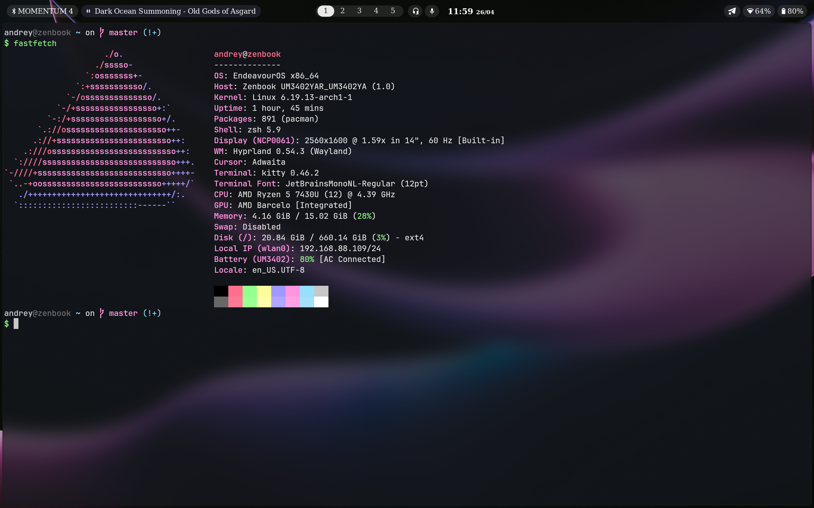
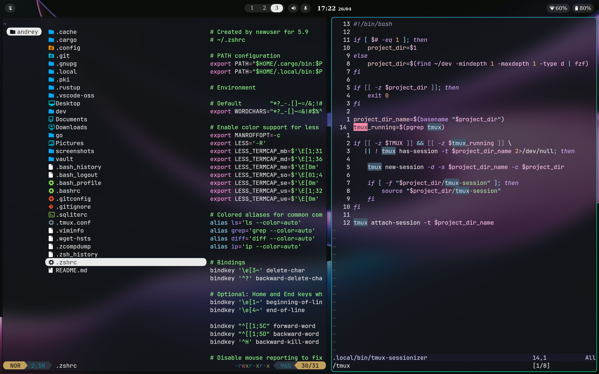

# dotfiles-hypr

My Arch-based Linux + Hyprland configuration files.

## Quick Start

```bash
git clone https://github.com/xjung/dotfiles-hypr.git
cd ~/dotfiles-hypr
```

#### Packages
```bash
pacman -S --needed - < ~/.config/pacman.list
```
```bash
yay -S --needed - < ~/.config/aur.list
```
```bash
cargo install $(cat ~/.config/cargo.list)
```

#### Config and scripts
```bash
cp -r .config/* ~/.config/
cp -r .local/* ~/.local/

cp .zshrc ~/
cp .tmux.conf ~/
cp .sqliterc ~/
```

## Structure
```
~/.config/
├── hypr/            # Hyprland window manager
├── waybar/          # Status bar
├── mako/            # Notification daemon
├── kitty/           # Terminal emulator
├── nvim/            # Neovim editor
├── wofi/            # Application launcher
├── wlogout/         # Logout menu
├── btop/            # System monitor
├── ncmpcpp/         # MPD client
├── yazi/            # File manager
├── starship.toml    # Shell prompt
└── Wallpapers/      # Wallpapers

~/.local/bin/        # Custom scripts
├── pacman-fzf
└── tmux-sessionizer

~/.zshrc             # Zsh shell
~/.tmux.conf         # Tmux multiplexer
~/.sqliterc          # Sqlite config
```

## Screenshots


